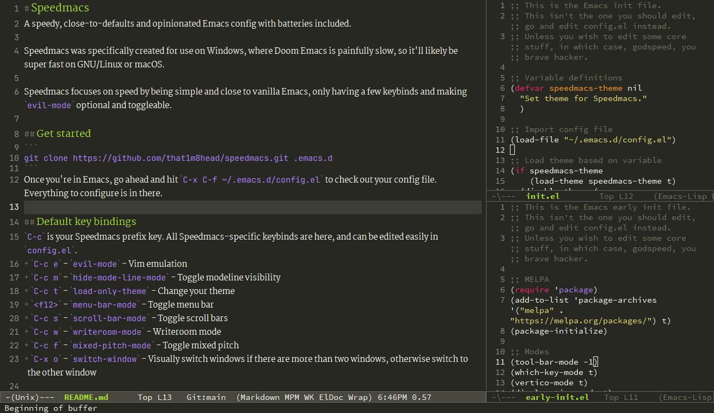

# Speedmacs
A speedy, close-to-defaults and opinionated Emacs config with batteries included.



Speedmacs was specifically created for use on Windows, where Doom Emacs is painfully slow, so it'll likely be super fast on GNU/Linux or macOS.

Speedmacs focuses on speed by being simple and close to vanilla Emacs, only having a few keybinds and making `evil-mode` optional and toggleable.

## Get started
```
git clone https://github.com/that1m8head/speedmacs.git .emacs.d
```
Once you're in Emacs, go ahead and hit <kbd>C-x</kbd> <kbd>C-f</kbd> and visit `~/.emacs.d/config.el` to check out your config file. Everything to configure is in there.

## Default key bindings
<kbd>C-c</kbd> is your Speedmacs prefix key. All Speedmacs-specific keybinds are here.

Keybinds are present in `init.el`, and may be edited if you wish, though additional keybinds should go in `config.el`.

+ <kbd>C-=</kbd> - `text-scale-increase`  - Increase the font size
+ <kbd>C--</kbd> - `text-scale-decrease`  - Decrease the font size
+ <kbd>&lt;f12&gt;</kbd> - `menu-bar-mode` - Toggle menu bar
+ <kbd>C-c</kbd> <kbd>e</kbd> - `evil-mode` - Vim emulation
+ <kbd>C-c</kbd> <kbd>m</kbd> - `hide-mode-line-mode` - Toggle modeline visibility
+ <kbd>C-c</kbd> <kbd>t</kbd> - `load-only-theme` - Change your theme
+ <kbd>C-c</kbd> <kbd>s</kbd> - `scroll-bar-mode` - Toggle scroll bars
+ <kbd>C-c</kbd> <kbd>w</kbd> - `writeroom-mode` - Writeroom mode
+ <kbd>C-c</kbd> <kbd>f</kbd> - `mixed-pitch-mode` - Toggle mixed pitch
+ <kbd>C-x</kbd> <kbd>o</kbd> - `switch-window` - Visually switch windows if there are more than two windows, otherwise switch to the other window

## Default packages (not including themes)
+ `which-key`
+ `switch-window`
+ `vertico`
+ `evil`
+ `adaptive-wrap`
+ `hide-mode-line`
+ `writeroom`
